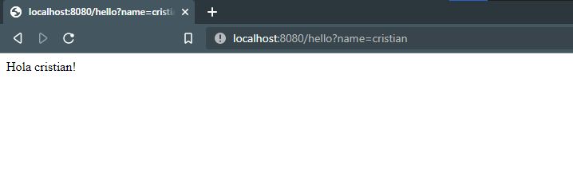
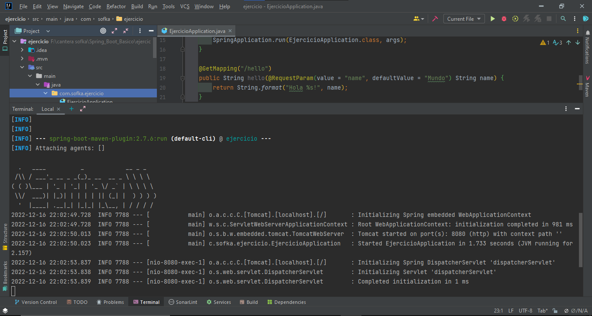

# SpringBootBasico

Hola Mundo! con Spring Boot

Para correr el codigo, abrir una terminal y utilizar el comando: mvn spring-boot:run

Abrir un navegador y utilizar la URL: http://localhost:8080/hello

Veremos el mensaje "Hola Mundo!"

Podemos cambiar el mensaje, en el navegador agregamos estas lineas al final de la URL: ?name=

Agregando un nombre cualquiera a continuación del símbolo de = obtendremos este resultado:

